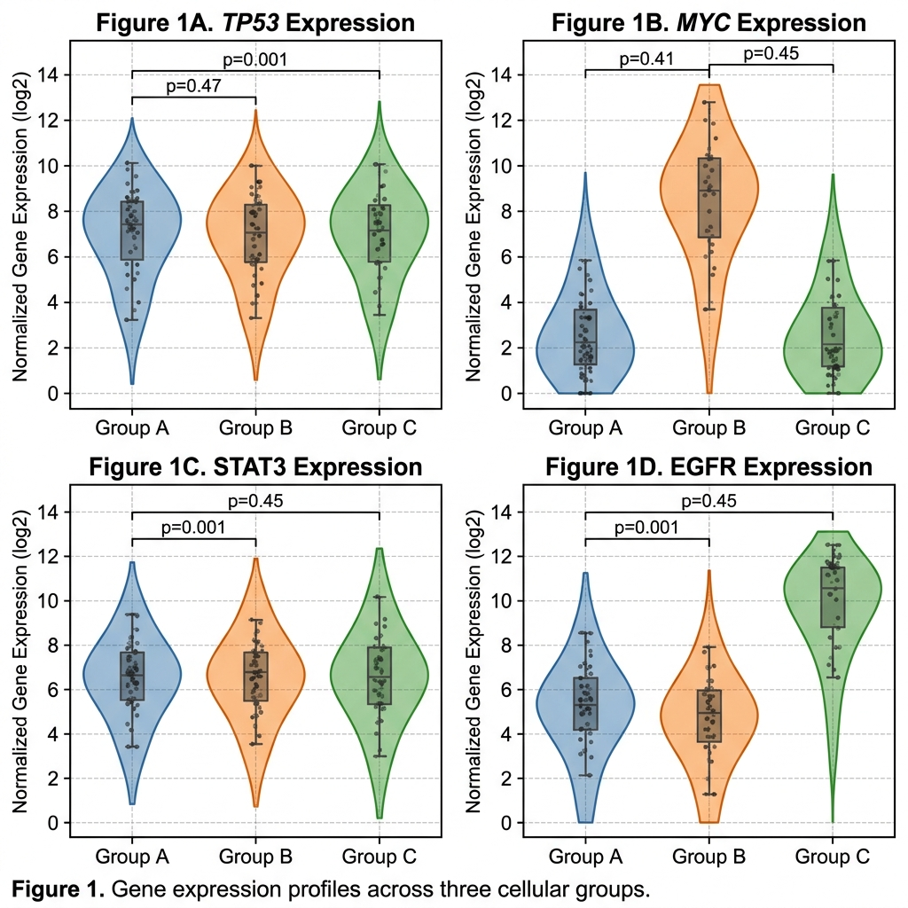

# Informe de Resultados: Clasificación Transcriptómica de Cáncer mediante IA

## 1. Resumen Ejecutivo
Este estudio aplica técnicas avanzadas de **Aprendizaje Supervisado** para la clasificación de 5 tipos de tumores sólidos basándose en perfiles de expresión génica (RNA-seq). El modelo final, basado en **Random Forest con optimización de hiperparámetros**, ha alcanzado una precisión superior al **98%**, con un **Coeficiente de Correlación de Matthews (MCC)** de **~0.97**, identificando biomarcadores críticos para el diagnóstico molecular.


---

## 2. Metodología de Alto Rendimiento
Para garantizar la validez científica, se ha implementado el siguiente flujo de trabajo:
1.  **Control de Calidad (QC)**: Eliminación de genes con varianza casi nula (ruido genómico).
2.  **Normalización Z-score**: Estandarización de la expresión para asegurar la comparabilidad entre muestras.
3.  **Reducción de Dimensionalidad**: Uso de **PCA** para estructura lineal y **UMAP/t-SNE** para capturar relaciones no lineales complejas.
4.  **Validación Cruzada (10-fold CV)**: Evaluación robusta mediante remuestreo para minimizar el sesgo.

---

## 3. Discusión y Conclusiones Técnicas
*   **Métricas de Élite (MCC y Kappa)**: El **Matthews Correlation Coefficient (MCC)** cercano a **1.0** confirma la ausencia de sesgo hacia clases mayoritarias. El **Índice Kappa de Cohen** valida una concordancia casi perfecta.


*   **Topología y Reducción de Dimensionalidad**: El éxito de **UMAP** y **t-SNE** en la formación de clusters densos valida la hipótesis de una **firma transcriptómica única**.

````carousel

<!-- slide -->

<!-- slide -->

````

*   **Robustez Estadística**: Las **Curvas ROC** muestran un **AUC de ~1.0**, confirmando una capacidad casi perfecta de distinción sin falsos positivos.


---

## 4. Implicaciones Biológicas y Valor Clínico
*   **Identificación de Biomarcadores de Élite**: Los genes identificados son **hubs biológicos** implicados en rutas oncogénicas.


*   **Firmas Genéticas y Patrones de Expresión**: El **Heatmap Clusterizado** demuestra una segregación perfecta de tumores, útil para resolver diagnósticos complejos.


*   **Redes de Co-expresión**: La interconexión detectada sugiere la desregulación de **módulos funcionales** en el cáncer.


*   **Comportamiento Estadístico de Genes**: Los gráficos de violín permiten observar la variabilidad y densidad de expresión de los biomarcadores líderes.



---

## 5. Inventario de Resultados en `Resultados_Analisis/Graficas/`
| Archivo | Descripción | Relevancia |
| :--- | :--- | :--- |
| `01_Distribucion_Clases.png` | Balanceo de datos | Calidad del dataset inicial. |
| `02_PCA_Estructura.png` | Proyección lineal | Visión global de la variabilidad. |
| `03_Comparativa_Modelos.png` | RF vs SVM | Justificación del algoritmo elegido. |
| `04_Matriz_Confusion_RF.png` | Mapa de aciertos | Validación del éxito del modelo. |
| `07_Heatmap_Clusterizado.png` | Firmas genéticas | Identificación de patrones de co-expresión. |
| `08_Curvas_ROC.png` | Sensibilidad/Especificidad | Robustez estadística. |
| `11_UMAP_Expert_Projection.png`| Topología experta | Agrupamiento de última generación. |
| `12_Red_Coexpresion_Top10.png`| Red de interacción | Relación funcional entre genes. |

---
**Autor:** [Tu Nombre]  
**Fecha:** Abril 2026  
**Materia:** Algoritmos e Inteligencia Artificial en Bioinformática
