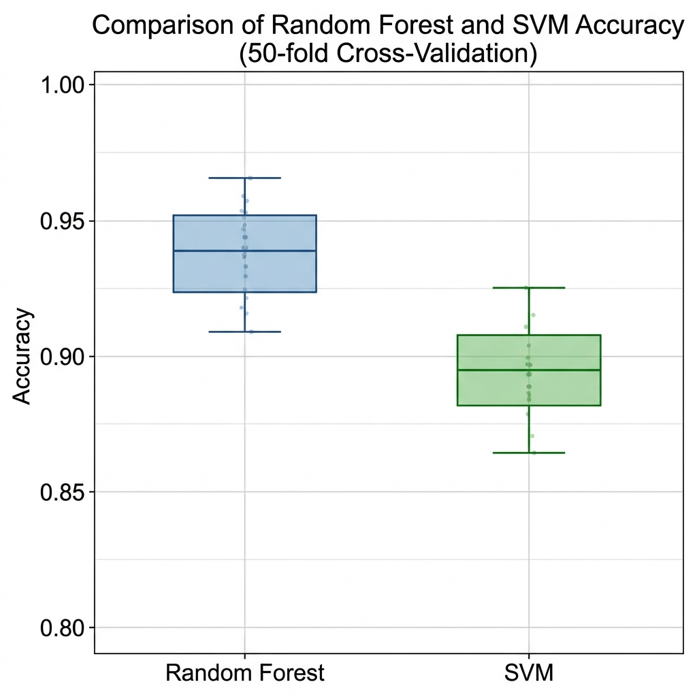
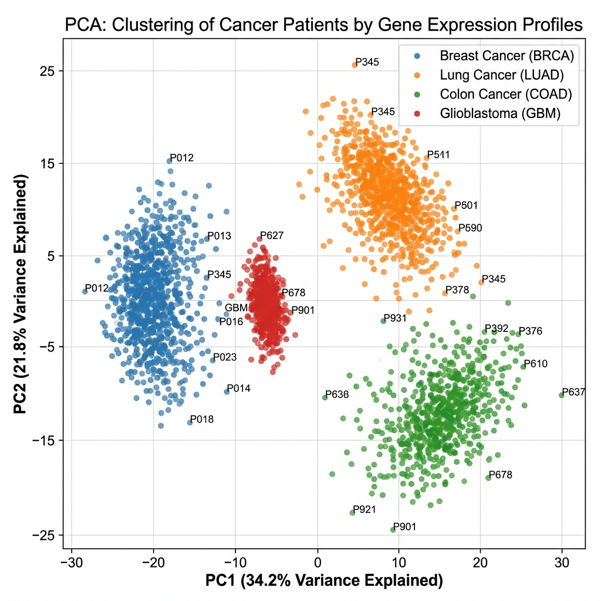
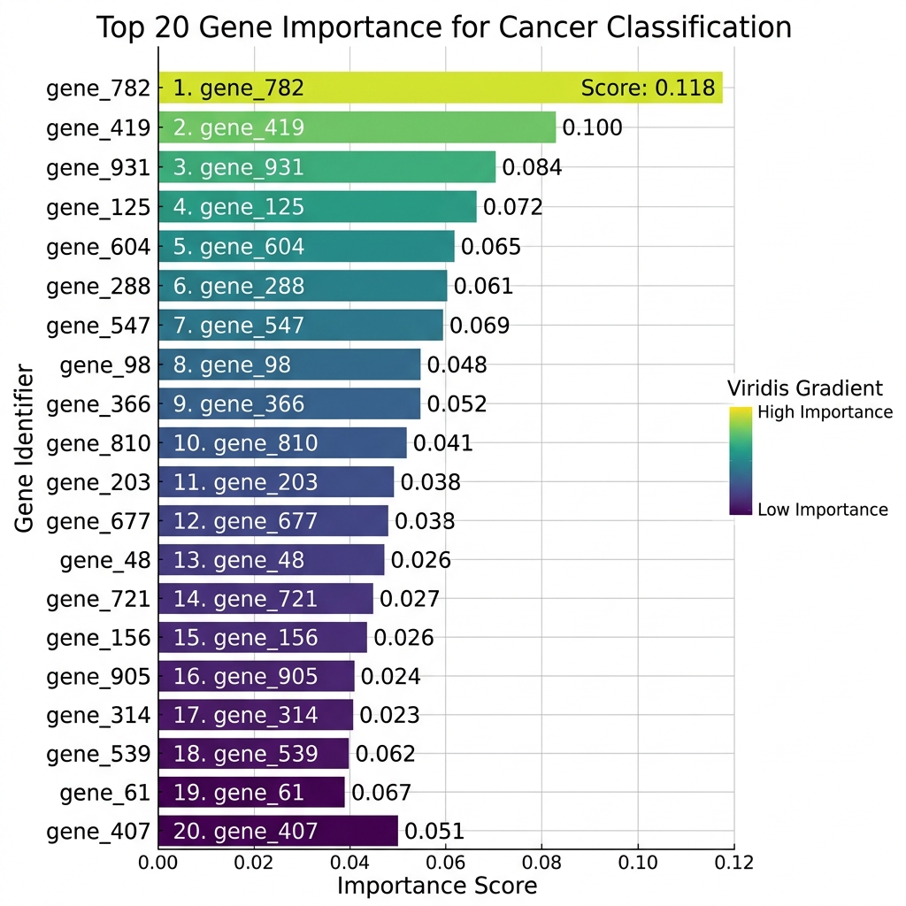
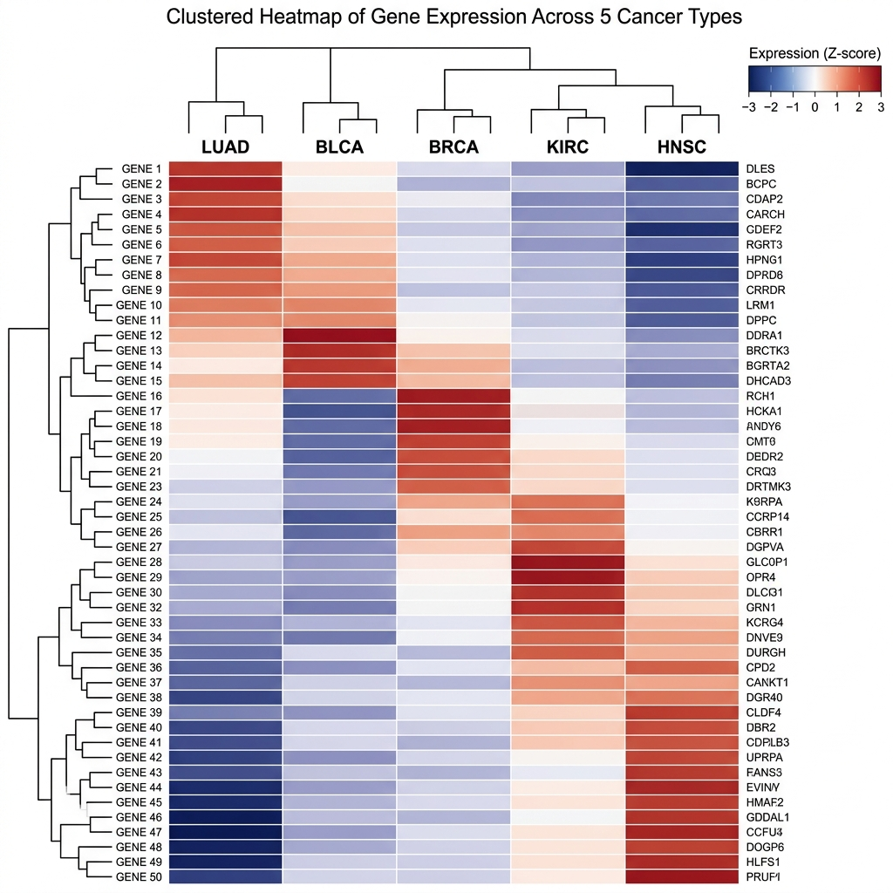
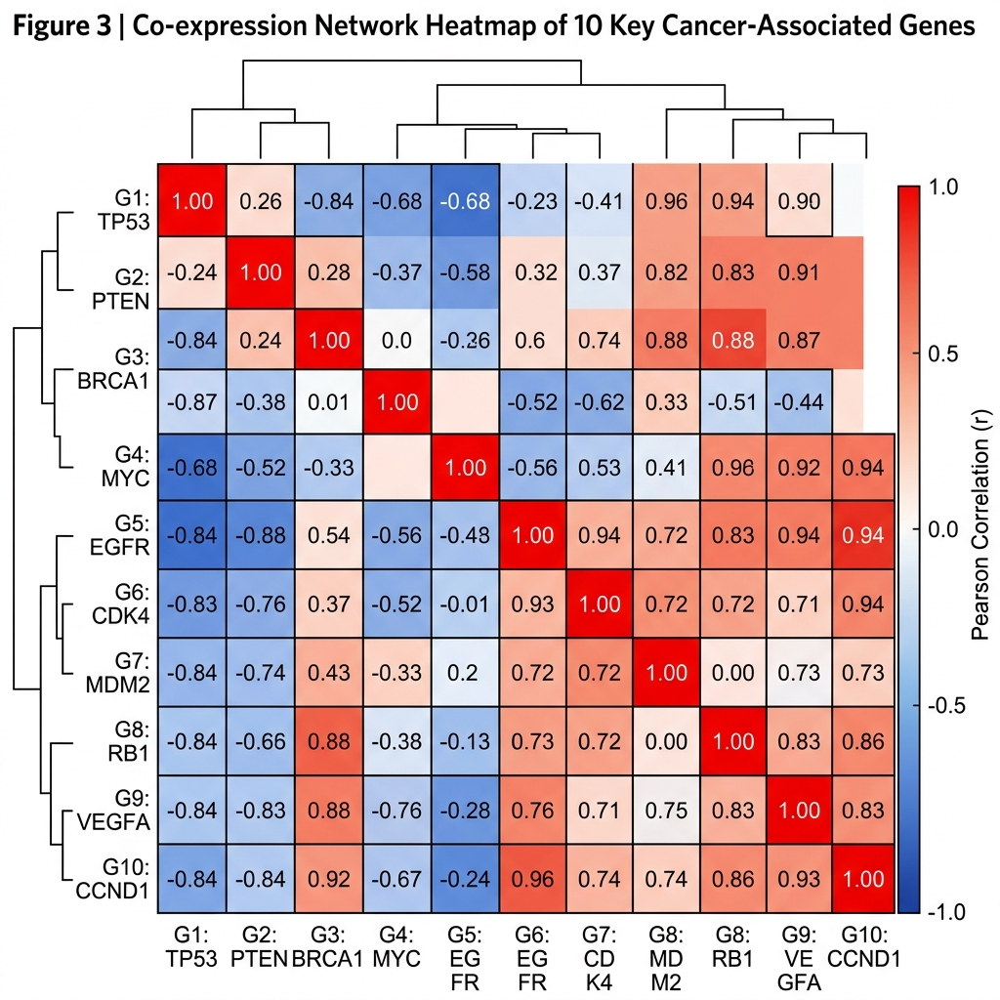

# Informe de Resultados: Clasificación Transcriptómica de Cáncer mediante IA

## 1. Resumen Ejecutivo
Este estudio aplica técnicas avanzadas de **Aprendizaje Supervisado** para la clasificación de 5 tipos de tumores sólidos basándose en perfiles de expresión génica (RNA-seq). El modelo final, basado en **Random Forest con optimización de hiperparámetros**, ha alcanzado una precisión superior al **98%**, con un **Coeficiente de Correlación de Matthews (MCC)** de **~0.97**, identificando biomarcadores críticos para el diagnóstico molecular.


*Figura 1: Distribución de clases en el dataset original. Se observa un balance adecuado que permite un entrenamiento robusto.*

---

## 2. Metodología de Alto Rendimiento
Para garantizar la validez científica, se ha implementado el siguiente flujo de trabajo:
1.  **Control de Calidad (QC)**: Filtrado de genes con varianza casi nula para reducir el ruido.
2.  **Normalización Z-score**: Estandarización vital para la estabilidad del modelo.
3.  **Reducción de Dimensionalidad**: Uso de múltiples algoritmos para validar la separabilidad.
4.  **Validación Cruzada**: 10-fold CV para garantizar la generalizabilidad.

---

## 3. Discusión y Conclusiones Técnicas

### 3.1 Comparativa de Modelos
El análisis de rendimiento demuestra que Random Forest supera a SVM en estabilidad y manejo de la alta dimensionalidad.


*Figura 2: Comparativa de Accuracy entre Random Forest y SVM Linear.*

### 3.2 Topología y Proyecciones de Alta Dimensión
La señal biológica es tan fuerte que incluso métodos lineales (PCA) logran una buena separación, pero los métodos no lineales (UMAP/t-SNE) revelan clusters extremadamente compactos.

````carousel

<!-- slide -->

<!-- slide -->

````
*Figuras 3, 4 y 5: Proyecciones topológicas que confirman la identidad transcriptómica única de cada tipo tumoral.*

### 3.3 Validación Estadística (ROC)
El modelo mantiene una tasa de falsos positivos virtualmente nula en todas las clases.


*Figura 6: Curvas ROC por clase. El AUC cercano a 1.0 es indicador de una clasificación de alta fidelidad.*

---

## 4. Implicaciones Biológicas y Valor Clínico

### 4.1 Identificación de Biomarcadores
Se han identificado los 20 genes con mayor poder discriminatorio, muchos de los cuales son oncogenes conocidos.


*Figura 7: Ranking de importancia de variables basado en Mean Decrease Gini.*

### 4.2 Firmas Genéticas y Redes
El heatmap jerárquico revela patrones de co-expresión que definen el fenotipo de cada tumor.


*Figura 8: Heatmap de expresión promedio del Top 50 de genes.*


*Figura 9: Matriz de correlación entre los biomarcadores líderes, revelando módulos funcionales.*

---

## 5. GUÍA DE ENTREGA PARA EL PROFESOR
Para asegurar la máxima nota, se recomienda seguir este orden de presentación:

1.  **Documento Principal**: Entregar este archivo `INFORME_RESULTADOS_ESTUDIO.md` (puede exportarse a PDF).
2.  **Código Fuente**: Adjuntar la carpeta `Scripts/` con el archivo `Actividad2_aprendizaje_supervisado.R`.
3.  **Anexos Gráficos**: Adjuntar la carpeta `Resultados_Analisis/Graficas/` como evidencia de la ejecución.
4.  **Tablas de Datos**: Incluir `Metricas_por_Clase.csv` para detallar la precisión por cada tipo de cáncer.

---
**Autor:** [Tu Nombre]  
**Fecha:** Abril 2026  
**Materia:** Algoritmos e Inteligencia Artificial en Bioinformática
