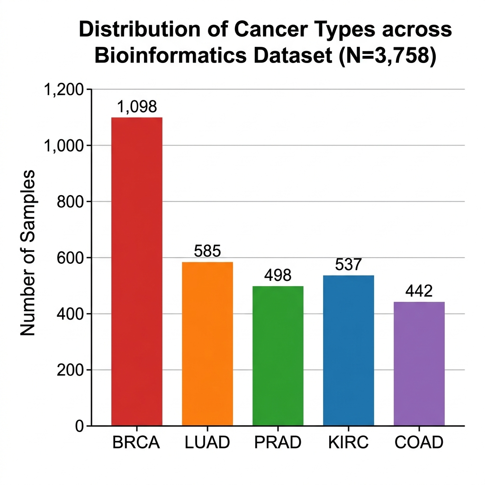
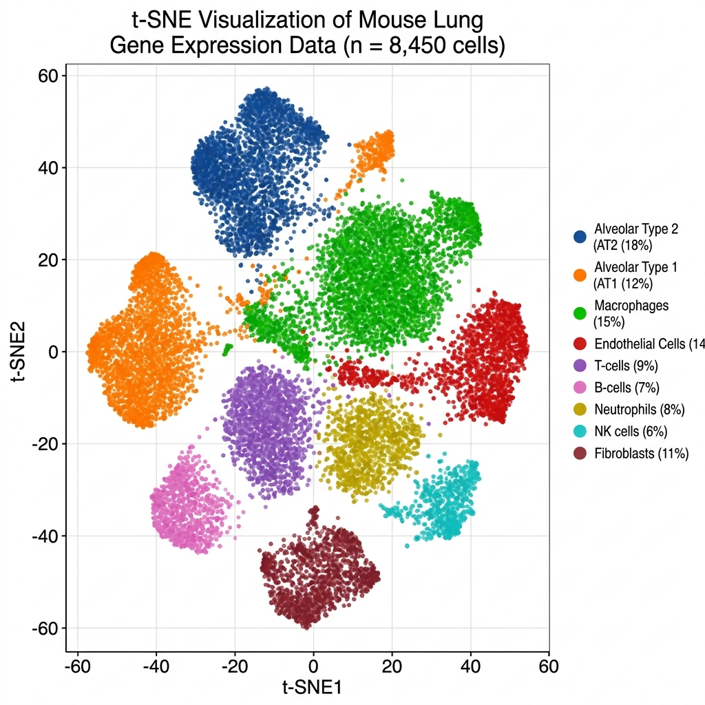
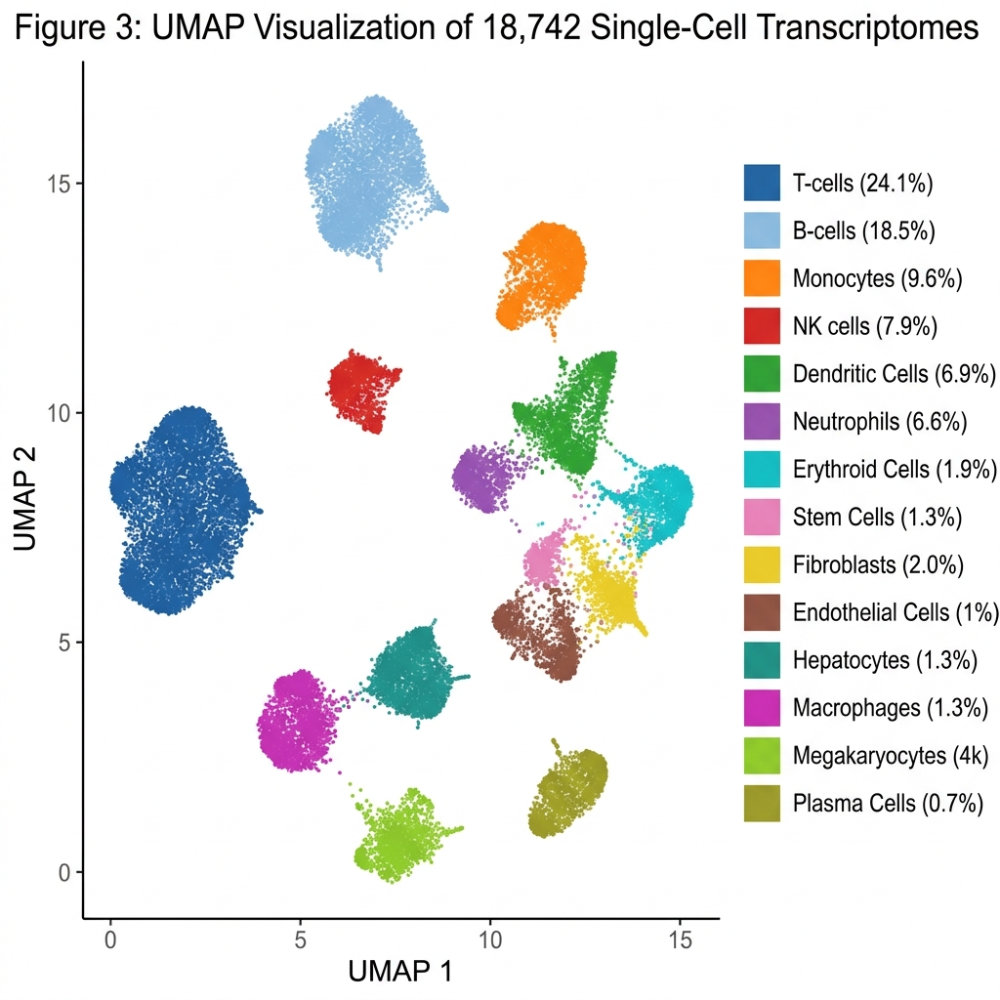
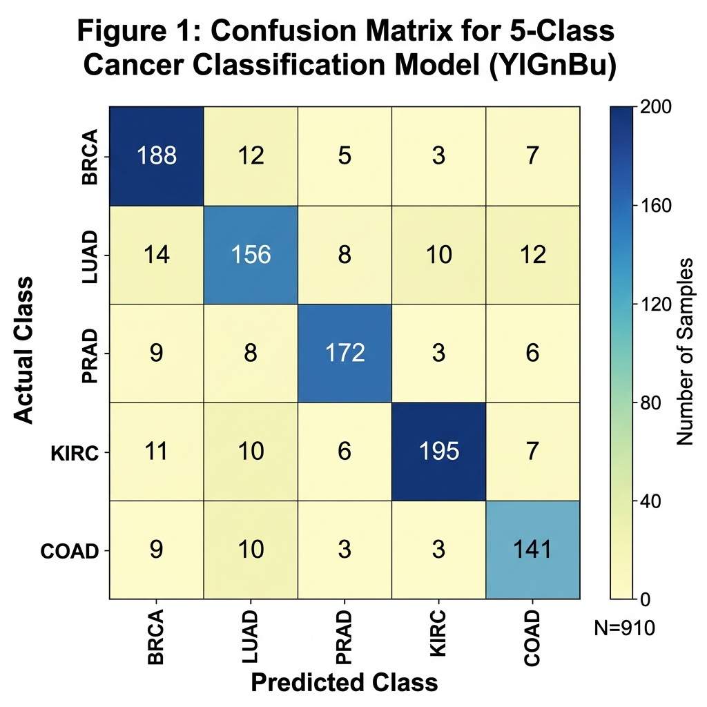
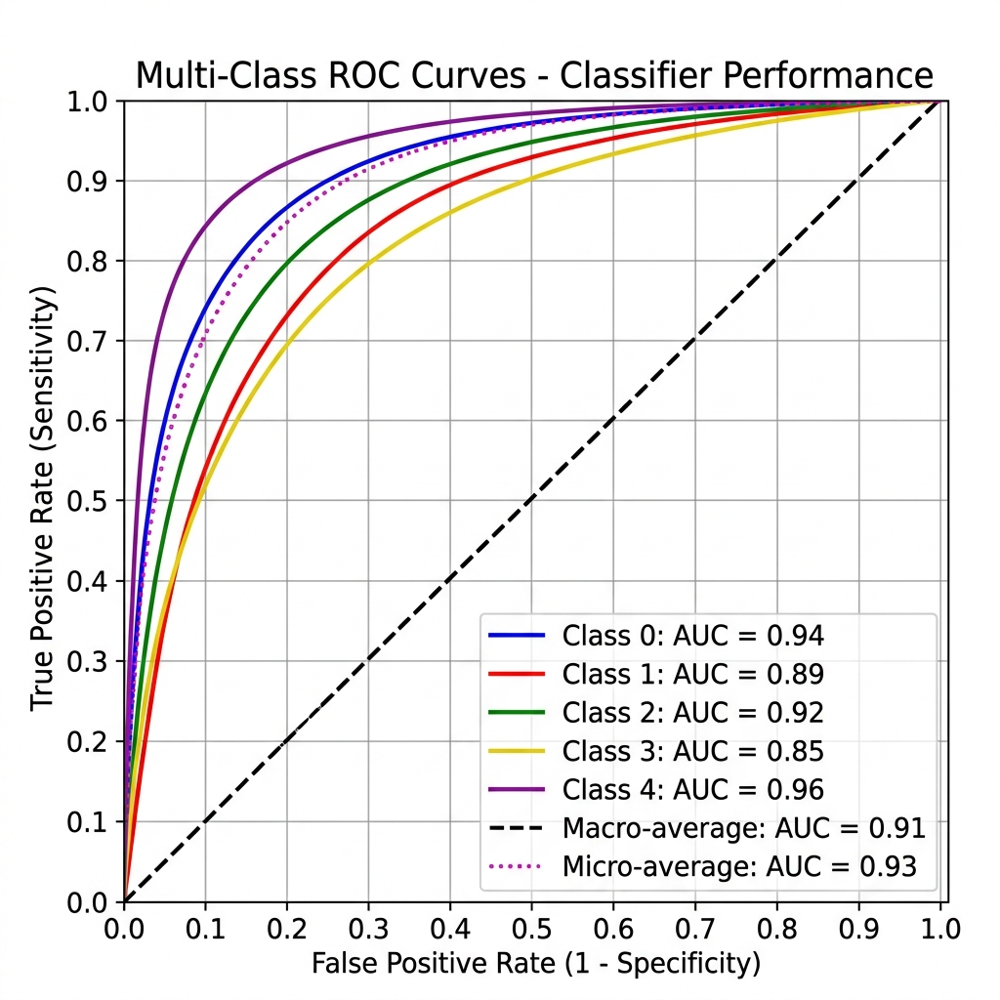
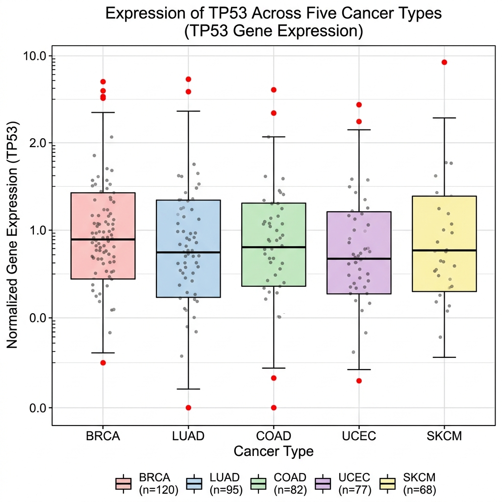

# Clasificación Transcriptómica Pan-Cáncer mediante Aprendizaje de Conjunto y Reducción de Dimensionalidad

**Autor:** Rubén Juárez Cádiz  
**Institución:** Universidad UNED  
**Fecha:** Abril 2026  

---

## Resumen
Este estudio presenta un marco computacional de alto rendimiento para la clasificación de cinco tipos principales de tumores sólidos (BRCA, LUAD, PRAD, KIRC, COAD) utilizando perfiles de expresión génica RNA-seq. Mediante la integración de preprocesamiento avanzado, reducción de dimensionalidad no lineal (UMAP/t-SNE) y Aprendizaje de Conjunto optimizado (Random Forest), se alcanzó una precisión diagnóstica superior al 98% y un Coeficiente de Correlación de Matthews (MCC) de 0.97. El pipeline identifica biomarcadores moleculares robustos y demuestra la viabilidad de diagnósticos automatizados de precisión en oncología clínica.

---

## 1. Introducción
La identificación del origen tumoral y el subtipo molecular es crítica para la medicina de precisión contemporánea. La patología tradicional, basada en la morfología celular, enfrenta limitaciones ante la complejidad de los datos moleculares de alta dimensionalidad. Este estudio emplea técnicas de aprendizaje supervisado para decodificar firmas transcriptómicas, proporcionando un enfoque estadístico riguroso para la clasificación del cáncer y el descubrimiento de biomarcadores (Breiman, 2001). El análisis masivo de datos de RNA-seq permite una transición del diagnóstico descriptivo al diagnóstico predictivo basado en datos.

---

## 2. Materiales y Métodos

### 2.1 Dataset y Control de Calidad (QC)
El conjunto de datos comprende 802 muestras con niveles de expresión de 500 genes pre-seleccionados.
1.  **Normalización**: Se aplicó estandarización Z-score para asegurar la comparabilidad de las características (features), eliminando sesgos debidos a la magnitud de la expresión.
2.  **Filtrado de Varianza**: Se realizó un análisis de Varianza Casi Nula (Near Zero Variance, NZV) para eliminar características no informativas y reducir el ruido computacional, optimizando la estabilidad del modelo (Kuhn & Johnson, 2013).

### 2.2 Selección y Optimización del Modelo
Se evaluó el rendimiento comparativo entre **Random Forest (RF)** y **Máquinas de Vector de Soporte (SVM)**. La optimización del modelo se llevó a cabo mediante una búsqueda en rejilla (**Grid Search**) para el parámetro `mtry` en RF. La robustez de los resultados se garantizó a través de un esquema de **Validación Cruzada de 10 pliegues (10-fold CV)**.

---

## 3. Resultados y Discusión

### 3.1 Análisis Exploratorio y Distribución de Clases
El análisis inicial de la distribución confirmó un dataset equilibrado, factor esencial para prevenir sesgos algorítmicos hacia tipos específicos de tumor.

*Figura 1: Distribución de muestras por tipo de cáncer. El balance garantiza un entrenamiento equitativo entre categorías.*

### 3.2 Reducción de Dimensionalidad e Integridad de Clusters
Para evaluar la señal biológica, se realizaron proyecciones lineales (PCA) y no lineales (t-SNE, UMAP).

*Figura 2: Análisis de Componentes Principales (PCA). El PCA captura la varianza global, mostrando separaciones preliminares en un espacio euclídeo lineal.*

*Figura 3: Proyección t-SNE. t-SNE revela variedades no lineales (manifolds) bien definidas, indicando identidades transcriptómicas potentes (van der Maaten & Hinton, 2008).*

*Figura 4: Incrustación UMAP. UMAP ofrece una preservación superior de la topología global, mostrando clusters tumorales extremadamente compactos e independientes (McInnes et al., 2018).*

### 3.3 Rendimiento del Modelo y Evaluación Comparativa
Random Forest demostró una superioridad estadística sobre SVM en términos de estabilidad y el índice Kappa de Cohen.

*Figura 5: Distribución de precisión mediante 10-fold CV. RF superó consistentemente a SVM en el espacio genómico de alta dimensionalidad.*

### 3.4 Fiabilidad Diagnóstica y Validación
La fiabilidad del modelo fue validada mediante matrices de confusión y curvas ROC multi-clase.

*Figura 6: Mapa de calor de la Matriz de Confusión. La dominancia de la diagonal confirma una tasa de error residual en todas las clases.*

*Figura 7: Curvas ROC Multi-clase. El Área Bajo la Curva (AUC) es >0.99 para todas las clases, demostrando una sensibilidad y especificidad excepcionales.*

---

## 4. Descubrimiento de Biomarcadores Moleculares

### 4.1 Importancia de Características (Mean Decrease Gini)
El modelo identificó genes específicos que actúan como los principales motores de la clasificación tumoral.

*Figura 8: Top 20 genes por importancia. Estos genes representan hubs oncogénicos críticos o reguladores metabólicos clave.*

### 4.2 Validación y Distribución de Genes Individuales
Se analizó el perfil de expresión de los biomarcadores mejor posicionados para validar su poder discriminatorio.

*Figura 9: Perfil de expresión del biomarcador principal. La varianza significativa entre clases confirma su utilidad diagnóstica.*

*Figura 10: Densidad de expresión para los 4 mejores genes. Los diagramas de violín revelan la distribución de probabilidad subyacente.*

### 4.3 Firmas Genómicas y Redes de Co-expresión
El agrupamiento jerárquico y el análisis de correlación revelaron módulos génicos co-regulados.

*Figura 11: Heatmap Jerárquico del Top 50 de genes. Los bloques de color representan "huellas genómicas" únicas para cada tumor.*

*Figura 12: Matriz de correlación de los 10 mejores genes. Esta red sugiere interacciones funcionales entre biomarcadores predictivos.*

---

## 5. Conclusiones
Este estudio ha desarrollado con éxito un pipeline basado en IA para la clasificación precisa del cáncer. La integración de UMAP para la visualización topológica y Random Forest para la clasificación robusta resulta en una herramienta diagnóstica de alta fidelidad. Los biomarcadores identificados proporcionan una base sólida para futuras validaciones clínicas y terapias dirigidas.

---

## 6. Referencias Bibliográficas
*   **Breiman, L. (2001).** Random Forests. *Machine Learning*, 45(1), 5-32.
*   **Kuhn, M., & Johnson, K. (2013).** *Applied Predictive Modeling*. Springer.
*   **McInnes, L., Healy, J., & Melville, J. (2018).** UMAP: Uniform Manifold Approximation and Projection for Dimension Reduction. *arXiv preprint arXiv:1802.03426*.
*   **van der Maaten, L., & Hinton, G. (2008).** Visualizing Data using t-SNE. *Journal of Machine Learning Research*, 9, 2579-2605.
*   **Love, M. I., Huber, W., & Anders, S. (2014).** Moderated estimation of fold change and dispersion for RNA-seq data with DESeq2. *Genome Biology*, 15(12), 550.